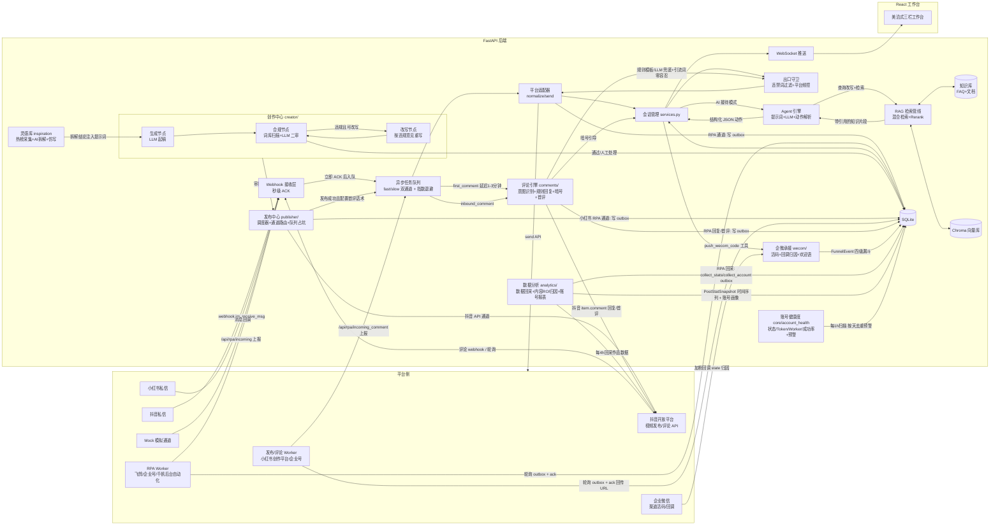
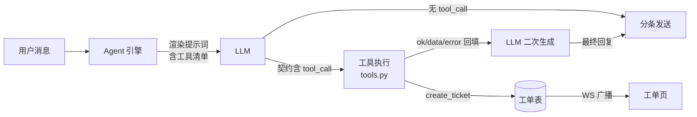

# 架构设计

## 整体架构

## 核心数据流

一条用户消息的完整旅程：

1. **接收**：`POST /webhooks/{platform}` 只做验签 → 入队 → 立即返回 200（满足平台 3~5s ACK 要求）
2. **消费**：fast 通道 worker 从 `queue_tasks` 取 `inbound_message`/`inbound_comment`（与内容生成等 slow 任务并发，互不阻塞），调用适配器 `normalize()` 转成统一 `InboundMessage`
3. **幂等**：按 `{platform}:{platform_msg_id}` 查 `processed_events` 去重表，重复直接丢弃
4. **入库**：upsert 客户 → 取/建会话 → 存消息 → WebSocket 广播到工作台
5. **入口内容安全**：`contentfilter.check_inbound` 对用户消息分级（block/warn），block 级直接转人工且 AI 不回复
6. **AI 接待**（会话 mode=ai 时）：
   - `context.py` 取最近 10 条原文 + 滚动小结
   - `rag/pipeline.py` 检索知识（改写 → 混合召回 → RRF → rerank → 阈值）
   - `prompt.py` 渲染提示词（热更新，自动注入可用工具清单）
   - LLM 输出严格 JSON 契约 → pydantic 校验（失败重试 1 次）
   - **工具调用循环**：契约含 `tool_call` 时执行工具（查订单/查物流/建工单），结果回填提示词后二次生成，最多 2 次防死循环
   - 执行动作：打标签 / 留资 / 转人工 / 拟人化分条发送
7. **出口守卫**：违禁词过滤（广告法词库）→ 平台频控计数（RPA 通道适用更严的 `<platform>_rpa` 规则）→ 出站适配器路由（`get_send_adapter` 按 `DOUYIN_CHANNEL`/`XHS_CHANNEL` 选官方 API 或 RPA）
8. **广播**：所有消息变更实时推送到工作台

### RPA 通道（降级接入）

无官方 API 资质时，平台消息经 RPA Worker（`workers/`，Playwright 自动化平台官方客服后台）桥接：

- **入站**：Worker 监听页面新消息（文本/图片/语音/人工旁路消息）→ 媒体上传 → `POST /api/rpa/incoming`（X-Rpa-Key 鉴权）→ 身份映射（昵称→稳定 ID，改昵称不断会话）→ 入队复用现有链路；语音经 `core/asr.py` 转写、图片经视觉模型描述为文本替身后进 LLM 上下文
- **出站**：RPA 通道的 `send()` 写 `rpa_outbox` 表（按 account 隔离、租约 60s 防丢）→ Worker 轮询拉取 → 页面拟人化发送 → ack 回执（失败 3 次告警）
- **运维**：Worker 心跳（90s 超时置 offline 告警）、媒体文件纳入备份、过期 outbox/媒体自动清理
- 详见 [rpa-workers.md](rpa-workers.md)

### 一条内容的旅程（创作 → 审批 → 发布 → 首评 → 数据回采）

1. **选题来源**：运营手动录入，或从灵感库「一键仿写」（灵感经 AI 拆解出标题公式/结构/钩子，注入创作提示词，参考方法论而非抄袭）
2. **创作**：运营在创作台录入选题/卖点 → `POST /api/contents/{id}/generate`（可选每平台 1-3 个风格变体）入队 `content_generate`（payload 带 `variant_index`）
3. **LangGraph 管线**：生成节点（`prompts/content_creator.md` 渲染平台规格+灵感参考块+变体风格指令+品牌语气，LLM 出严格 JSON）→ 合规节点（违禁词+引流词扫描 + LLM 二审）→ 违规则改写节点重写（最多 2 轮）→ 落库 `content_versions`（含 `variant_no`）与合规报告，同时计算 **SimHash 查重报告**（同平台近 90 天版本对比，排除同选题的兄弟变体）
   - 编辑辅助：标题助手（LLM 出 10 个候选标题，标注公式/评分）、关键词埋词（LLM 推荐品类热搜词 + 覆盖检测，一键加入话题标签）、平台化预览卡（图文笔记/视频脚本样式）、规格实时计数
4. **审批流**：版本全部合规通过后「提交审核」（draft → reviewing）→ 管理员通过/驳回（驳回必填原因，回 draft）→ approved 才可发布；发布/入队接口硬校验审批状态
5. **发布**：创建发布任务（选账号/定时，或「加入队列」按账号时段位自动占坑）→ 查重软拦截（相似度 >0.9 需显式确认）→ 调度器每 30s 扫到期任务 → 频控检查（总开关 + 账号日上限，超限自动推迟次日 9 点）→ 通道路由：抖音走 `video.create` API（token 自动刷新），小红书走 RPA outbox
6. **回执**：同步通道立即拿到 post URL；RPA 通道由 Worker ack 回传 URL，`reconcile_async_tasks` 每 30s 对账落库 `posts`
7. **首评引流**：版本配置了首评话术时，发布成功钩子延迟 1-3 分钟入队 `first_comment` → 出口守卫（引流词零容忍）+ 频控（与评论回复共用额度）→ 抖音 API / RPA Worker 发顶层评论（`{code}` 自动替换暗号）
8. **数据回采**：`stats_collection_loop` 每 4 小时对 7 天内的作品回采播放/点赞/评论/分享/收藏（抖音 API / 小红书 RPA `collect_stats` outbox / Mock 合成），写 `post_stat_snapshots` 时间序列并刷新 `posts.stats_json`；同轮顺带回采**账号画像**（粉丝/作品/获赞：抖音用户数据 API / RPA `collect_account` outbox / Mock 合成）写 `matrix_accounts.profile_json`
9. **效果反哺**：效果页作品排行/趋势曲线 + 选题 ROI（播放数据 × 漏斗四级）+ **账号对比报表**（发布数/互动/漏斗/成功率/健康度/粉丝数），最佳时段推荐（历史播放按发布小时聚合，数据不足回退平台黄金时段）
10. **账号健康度**：`account_health_loop` 每小时扫描全账号（状态 / refresh_token 年龄 / Worker 心跳 / 近 7 天发布成功率）→ 分数与等级（good/warn/bad）→ 问题账号按「账号+问题+日期」去重后走 monitor 告警；账号页展示健康点与授权到期倒计时，存在 bad 账号时顶部红色 banner

### 一条评论的旅程（采集 → 回复 → 引流 → 加微）

1. **采集**：抖音评论 webhook（或 `comment_polling_loop` 5 分钟轮询兜底）/ 小红书评论 Worker 上报 → 统一入队 `inbound_comment`
2. **入库与归因**：按 `platform_comment_id` 幂等 → 关联 `posts` 找到来源作品 → 写 `FunnelEvent(comment)`
3. **意图识别**：LLM 分类（咨询/问价/好评/差评/广告/无关，严格 JSON 契约）
4. **回复决策**：差评/广告/无关 → 跳过转人工；咨询/问价/好评 → 先匹配规则模板（含 `{code}` 暗号占位），无命中走 LLM 兜底生成
5. **出口守卫**：回复文本过违禁词 + **引流词零容忍**（评论区绝不出现微信号）→ 频控（账号小时/日额度）→ 通道发送（抖音 API / RPA outbox）
6. **暗号接力**：用户看到回复后私信暗号 → 私信链路的暗号钩子命中 → 客户打标 + `FunnelEvent(dm)`
7. **留资加微**：AI 客服确认用户意愿 → `push_wecom_code` 工具推送活码口令 + `FunnelEvent(lead)` → 用户扫码加企微 → 企微回调按 state 归因 → `FunnelEvent(wecom)` + 20s 内自动发欢迎语
8. **看板**：漏斗页四级计数/转化率/平台账号下钻；Dashboard 今日评论/留资/加微卡片

### 工具调用（function calling）流程

## 模块职责

| 模块 | 职责 |
|---|---|
| `core/queue.py` | 双通道 asyncio worker（fast=私信/评论入站，slow=生成/发布/首评）+ SQLite 持久化；失败指数退避 30s/60s/120s，重试用尽 `queue_task_failed` 告警 |
| `core/idempotency.py` | 事件幂等去重（唯一索引保证并发安全） |
| `core/ratelimit.py` | 平台频控计数（抖音 24h/6 条等，规则表可配） |
| `core/contentfilter.py` | 出口违禁词改写、入口风险分级（block/warn）、留资脱敏 |
| `core/security.py` | bcrypt 密码哈希、JWT 签发校验 |
| `core/monitor.py` | 滑动窗口错误计数 + 阈值告警（钉钉/企微 webhook） |
| `core/account_health.py` | 账号健康度：状态/refresh_token 年龄/Worker 心跳/发布成功率 → 分数+等级+问题清单；按天去重预警 |
| `core/backup.py` | 定时自动备份 SQLite + Chroma，滚动保留 |
| `core/audit.py` | 操作审计留痕（接管/释放、知识库变更、AI 开关等），写失败不影响主流程 |
| `adapters/` | 平台抽象：verify_webhook / normalize / send |
| `rag/` | 入库切分、向量/BM25/rerank、查询改写、检索管线 |
| `agent/engine.py` | LLM 调用（主备切换）、契约校验、工具调用循环、动作执行 |
| `agent/tools.py` | 业务工具注册表：查订单/查物流/建工单，异常兜底 |
| `agent/context.py` | 上下文窗口：最近 10 条原文 + 滚动小结压缩 |
| `agent/humanize.py` | 拟人化分条发送、打字延迟 |
| `agent/router.py` | 会话分配（在线客服中接待数最少） |
| `api/tickets.py` | 工单 CRUD/状态流转/指派 |
| `api/settings.py` | 运行时设置：AI 全局熔断开关（admin）、审计日志只读列表 |
| `api/evals.py` | badcase 导出为 evals/cases.json 草稿（admin），人工审阅后合入回归 |
| `services.py` | 业务中枢：入站处理（含入口安全、AI 熔断、暗号钩子）、出站发送、转人工、广播 |
| `main.py` | 装配：会话超时清扫（session_sweeper）、worker、备份任务、发布调度/评论轮询循环 |
| `creator/graph.py` | LangGraph 创作管线装配：生成→合规→（改写循环≤2）→落库 |
| `creator/nodes.py` | 图节点纯函数：生成/合规/改写/持久化；`check_text_compliance` 供手动复检复用；灵感参考块/变体风格（VARIANT_STYLES）/品牌语气注入提示词 |
| `creator/llm.py` | LLM JSON 调用工具：契约校验、解析失败重试、主备切换、用量记录 |
| `creator/composer.py` | 图文成片：FFmpeg 合成（Ken Burns/字幕/TTS/BGM），素材规格校验 |
| `creator/dedup.py` | SimHash 64 位指纹查重（纯 Python）：落库时生成 dup_report，发布前软拦截（>0.9 需 force） |
| `publisher/scheduler.py` | 发布调度：到期扫描、频控/配额、通道执行、RPA 异步对账、首评钩子触发 |
| `publisher/queue.py` | 发布队列：账号时段位占坑（±30min 窗口/日限额）、最佳时段推荐（历史播放驱动，不足回退默认值） |
| `publisher/channels/` | 发布通道抽象：`douyin_api`（视频上传+创建+token 刷新）、`xhs_rpa`（异步入 outbox）、`mock` |
| `comments/engine.py` | 评论引擎：幂等入库、LLM 意图分类、规则/LLM 回复、引流词守卫、频控 |
| `comments/rules.py` | 评论回复规则：关键词+意图命中、模板渲染（`{code}` 暗号占位）、默认规则初始化 |
| `comments/douyin_api.py` | 抖音 item.comment 客户端（列表/回复/顶层评论）+ 5 分钟轮询兜底 |
| `comments/sender.py` | 回复/首评通道路由：抖音 API 直发 / RPA outbox |
| `comments/first_comment.py` | 首评引流：发布成功延迟 1-3 分钟发顶层评论（`{code}` 暗号渲染、出口守卫、频控共用） |
| `analytics/collector.py` | 作品数据回采（抖音 API / RPA collect_stats outbox / Mock）+ 账号画像回采（粉丝/作品/获赞：抖音用户数据 API / RPA collect_account / Mock） |
| `analytics/attribution.py` | 内容 ROI 归因（选题聚合 + 漏斗）+ 账号维度效果报表（发布/互动/漏斗/成功率/健康度/画像） |
| `wecom/crypto.py` | WXBizMsgCrypt：AES-256-CBC 加解密 + SHA1 签名（不依赖官方 SDK） |
| `wecom/channel_code.py` | 企微 API 客户端：token 缓存 7000s、活码创建、欢迎语发送 |
| `wecom/callback.py` | 企微回调：URL 验证、加粉事件 state 归因、20s 欢迎语窗口 |
| `api/accounts.py` | 矩阵账号 CRUD + 批量导入（逐行校验）+ 健康度聚合 + 抖音 OAuth 闭环（授权/回调/刷新），凭证 Fernet 加密 |
| `api/contents.py` | 内容项/版本/素材管理，AI 生成（一稿多版 variants）与合规复检异步入队，标题助手/关键词埋词 |
| `api/publish.py` | 发布任务 CRUD/取消/重试/改期/导出发布包，月历聚合、队列入队、最佳时段，已发布作品列表 |
| `api/comments.py` | 评论列表/人工回复/跳过，回复规则 CRUD |
| `api/analytics.py` | 作品数据排行/单作品趋势/选题 ROI 排行/账号对比报表 |
| `api/inspiration.py` | 灵感库 CRUD、RPA 热榜导入（X-Rpa-Key）、AI 拆解、一键仿写 |
| `api/funnel.py` | 漏斗四级聚合/明细，企微活码创建（API/手工录入） |
| `api/settings.py` | 运行时设置：AI 全局熔断 + 自动化开关（评论/发布，admin）+ 品牌语气（brand_style_guide，admin）、审计日志只读列表 |
| `api/queue_ops.py` | 队列运维（admin）：失败任务列表 + 手动重试（重置 retries/退避重回 pending） |

## 关键设计决策

### 为什么是「严格 JSON 契约」而不是自由文本
自由文本无法驱动动作（转人工/打标签/留资）。契约让 LLM 的输出**可执行**：后端 pydantic 校验 → 解析 → 执行，同时约束模型行为边界。

### 为什么 webhook 必须异步解耦
抖音/小红书要求 3~5 秒内 ACK，超时重推。而 RAG + LLM 全链路 5~15 秒。同步处理必然超时 → 平台重推 → 重复回复。队列解耦是唯一正解。

### 为什么频控在发送层而不是提示词层
平台规则（如抖音 24h 回 6 条）是硬约束，LLM 不可靠计数。发送层计数超限自动转人工，宁可少发不可封号。

### 为什么上下文用「原文 + 滚动小结」
全量历史 token 成本随对话线性爆炸。最近 10 条保证短期连贯，滚动小结保留长期记忆（用户需求/已给信息/情绪），成本可控。

### 降级链设计
每一层外部依赖都有降级，保证「最小配置（仅 LLM key）即可跑通」：
- 无 Embedding → 纯 BM25 检索
- 无 Rerank → 融合序直出，跳过阈值判定
- 无平台凭证 → 发送降级为日志，Mock 通道全流程可用
- 无 LLM → 固定话术 + 直接转人工
- 主 LLM 故障 → 自动切换备用模型（`LLM_FALLBACK_*`），全挂才转人工
- 工具执行异常 → 结果回填为 ok=false，由 LLM 安抚用户并转人工

### 为什么只有创作模块用 LangGraph，其余不用
创作是**有循环回路的确定性工作流**（生成→合规→改写→再合规），图结构让循环、分支、状态显式化，且每节点是纯函数可单测。而评论引擎、发布调度、私信客服都是**线性管道**（采集→分类→回复/执行），用 LangGraph 只会增加概念成本没有收益——过度设计比设计不足更有害。
- **回退策略**：`creator/graph.py` 编译失败或 langgraph 未装时，可按 nodes.py 的纯函数顺序手工串联，行为等价
- **扩展触发条件**（满足任一才考虑推广到其他模块）：创作流程演进为自主多轮 pipeline / 出现多 Agent 协作 / 单工作流步骤超 5 个且含 2 个以上循环回路

### 为什么查重是「软拦截」而不是硬阻断
矩阵账号发高度相似内容会被平台判同质化限流，但「参考爆款结构改写」本身就是合法且常用的创作方法（灵感库仿写链路）。相似度 >0.9 时返回 409 要求显式 `force=true` 确认——把决策权留给运营，同时确保每一次高风险发布都是「知情且留痕」的（审计日志记录）。

### 为什么首评延迟 1-3 分钟且与评论回复共用频控
发布瞬间秒评是典型机器行为特征，随机延迟 60-180s 模拟真人操作间隔；首评与普通回复共用账号评论日限额和小时窗口——平台风控看的是账号总行为频率，分开计数等于自欺欺人。首评同样过引流词零容忍守卫，只引导私信暗号，绝不出现联系方式。

### 为什么 token 预警盯 refresh_token 年龄而不是 access_token 过期时间
抖音 access_token 有效期短（小时级）且发布通道已带自动刷新，按它预警只会制造误报噪音；真正需要人工介入的是 **refresh_token 失效**（约 30 天，失效后必须重新扫码授权）。健康度模块用 credentials 的 `saved_at` 近似 refresh_token 年龄：≥23 天（剩余 ≤7 天）warn、≥30 天 bad——预警窗口恰好覆盖「运营每周看一次账号页」的节奏。

### 为什么一稿多版用「生成时风格注入」而不是「生成后改写」
同一选题要多版本是为了 A/B 测风格（测评/提问/清单），若先生成一版再让 LLM 改写，变体间会保留大量相同句式，SimHash 查重必然互撞。改为生成时按 `variant_index` 注入不同风格指令（`VARIANT_STYLES`），从源头保证差异化；同时查重排除同 `content_item_id` 的兄弟变体——它们是刻意备选，不是同质化事故。账号创建时的 `open_id` 占位（`pending_*`）同理：`(platform, open_id)` 唯一索引本是防重复授权，不应误伤「先建号后授权」的正常流程。

### 为什么评论区零联系方式（引流词零容忍）
公开场域（帖子正文/评论）留微信是平台重点打击行为，一旦命中轻则删评重则封号，整个矩阵账号受牵连。所以引流词扫描（`contentfilter.scan_drain`）独立于普通违禁词表，只作用于公开内容；私信场域的合法引导（暗号/活码口令）不受影响。公域只做「暗号引导私信」，私域才完成留资与加微——这是风控与转化的平衡点。

### 为什么队列分 fast/slow 双通道
私信/评论入站要求秒回，内容生成、图文成片、发布调度是分钟级慢任务。单循环串行消费时，一条 LLM 生成任务会堵住整条私信回复。表结构不变、按 `task_type` 分两个独立 worker 循环：fast 只取 `inbound_message`/`inbound_comment`，其余走 slow。失败重试复用 `not_before` 做 30s/60s/120s 指数退避，避免依赖方故障时瞬间打满 3 次。失败任务在设置页「队列运维」可见、可手动重试。

### 为什么素材文件用 HMAC 签名 URL 而不是 JWT
素材 URL 会被复制进发布包文本外发（运营粘贴到平台后台），拼 JWT 等于把全权限 token 泄露给任意拿到链接的人。HMAC(`secret_key`, `material:{id}`) 截断 16 位：免登录可预览（`` 无法带 Authorization 头），但整型主键遍历拿不到 sign，无法拖库。客服媒体 `/api/media/{id}` 仍走 `?token=` JWT，因为那是工作台内预览、不外发。

### 单实例边界与扩容路径
当前进程内有三处「只服务本进程」的状态：
- `core/queue.py` 的 `_wakeup` 事件：跨进程无法唤醒 worker
- `api/ws.py` 的 `ConnectionManager.active`：跨进程广播丢失
- SQLite + WAL：适合单写者，多 uvicorn worker 会锁竞争

因此生产默认 **单 uvicorn 进程**（docker-compose 亦如此）。水平扩容前置条件：换 PostgreSQL → 外部队列（Redis/RQ 或 PG `LISTEN/NOTIFY`）→ WS 广播层（Redis pub/sub）。在流量未达日咨询 500+ 之前，单实例 + 双通道队列足够。详见 [deployment-checklist.md](deployment-checklist.md)。

### 会话生命周期
- AI 接待会话超过 `SESSION_TIMEOUT_MINUTES`（默认 30 分钟）无消息 → 自动发结束语并关闭
- 关闭后用户再发消息会自动开新会话
- pending（排队待人工）/ human（人工接待中）会话不参与超时自动关闭，由客服负责
