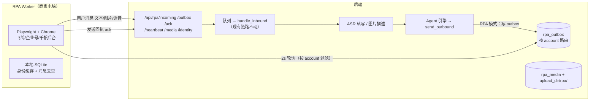

# RPA Workers 接入指南（无官方 API 资质时的降级通道）

RPA（Robotic Process Automation）通道用 Playwright 自动化平台**官方客服后台**（抖音飞鸽 / 抖音企业号后台 / 小红书千帆 Web），
把用户消息桥接到本系统，AI/人工回复经 outbox 由 Worker 发到平台。
对会话管理、RAG、工作台、统计完全透明——只是多了一种「平台适配器」。

抖音侧按账号形态二选一（企业私信 OpenAPI 已「内测结束暂不开放」，不用考虑）：

| 账号形态 | 目标后台 | Worker driver | 前置条件 |
|---|---|---|---|
| 抖店商家 | 飞鸽客服工作台 | `douyin_feige_worker.py` | 抖店主账号或客服子账号 |
| 蓝V 企业号（无抖店） | 企业服务中心 `e.douyin.com` 消息管理 | `douyin_enterprise_worker.py`（本期新增） | 蓝V 认证（600 元/年）+ e.douyin.com 开通「客服管理」权限（1-3 个工作日审核，需营业执照 + 法人身份证） |

> **合规红线（务必阅读）**
> - RPA 违反平台用户协议，**有封号风险**，仅限自有账号、低频拟人化使用
> - 定位为「无 API 资质时的降级通道」；获得官方权限后应立即切回 `DOUYIN_CHANNEL=api`
> - 严禁用于他人账号或爬取数据

## 一、前置条件（不满足不要上线）

| # | 条件 | 原因 |
|---|---|---|
| 1 | **关闭平台自带自动化**：飞鸽「智能客服机器人」、企业号「自动回复/智能客服」（e.douyin.com → 消息管理）、千帆「自动回复」关闭或设为仅人工 | 否则用户收到平台机器人 + 本系统 AI 的**双份回复**（抢答） |
| 2 | 后端配置 `RPA_API_KEY`（随机 32 位 hex），Worker `.env.local` 填同一个 | Worker 接口鉴权 |
| 3 | 后端对应平台通道设为 RPA：`DOUYIN_CHANNEL=rpa` / `XHS_CHANNEL=rpa` | 出站路由到 outbox |
| 4 | Worker 机器常驻运行（Windows 可），网络可达后端 | Chrome 常驻 |
| 5 | 生产建议 `HEADLESS=true`（新版无头模式） | Windows 锁屏不影响无头浏览器 |

## 二、架构与数据流



关键设计：

- **Pull 模式**：Worker 主动轮询 outbox，本机不开端口，NAT/防火墙无感
- **租约机制**：拉取置 `leased`（60s），Worker 崩溃未 ack 自动回滚 `pending`，不丢消息
- **多账号隔离**：每个店铺一个 `account` + 一个 Worker；会话 ID 带 `<account>:` 前缀，outbox 按 account 过滤，**消息不串线**
- **身份映射**：平台昵称 → 稳定内部 ID（`rpa_<account>_xxx`），用户改昵称由 Worker 按会话位置连续性上报 `prev_nickname` 迁移映射，**会话不断**
- **旁路消息同步**：客服直接在平台后台打字，Worker 识别我方气泡 → `sender_side=agent` 入库，工作台消息流完整（不触发 AI）。旁路消息不产生未读红点，因此 Worker 每轮除未读会话外还会扫描列表顶部 3 个最近会话（`SCAN_RECENT`），靠消息键去重不会重复上报
- **平台入口地址**：飞鸽 `https://im.jinritemai.com/pc_seller_v2/main/workspace`、企业号 `https://e.douyin.com/`（消息管理页）、千帆私信 `https://ark.xiaohongshu.com/ark/message/platform/msg`；平台改地址时在 `.env.local` 配置 `PLATFORM_URL` 覆盖，无需改代码
- **企业号频控差异**：企业号官方规则为用户回复后 48h 内可发 6 条、主动触达 1 小时 ≤40 人 / 1 天 ≤100 人（与抖店 24h/6 条不同）；后端 `douyin_enterprise_rpa` 规则已对齐，Worker 侧无需配置
- **媒体管线**：用户图片/语音 → Worker 抓字节上传 → ASR 转写/视觉描述 → 文本替身进 LLM 上下文；出站图片 → outbox 带 media_id → Worker 下载后页面附件发送

## 三、快速开始

```bash
cd workers

# 1. 一键安装（venv + 依赖 + Chromium + 生成 .env.local 与随机 key）
.\setup.ps1          # Windows
bash setup.sh        # Linux/macOS

# 2. 编辑 .env.local：BACKEND_URL / ACCOUNT（店铺标识）/ PLATFORM
#    并把同一个 RPA_API_KEY 填到后端 .env
#    平台入口默认：飞鸽 https://im.jinritemai.com/pc_seller_v2/main/workspace
#    企业号 https://e.douyin.com/（消息管理页）
#    千帆 https://ark.xiaohongshu.com/ark/message/platform/msg
#    （平台改地址时用 PLATFORM_URL 覆盖，无需改代码）

# 3. 首次登录引导（有头浏览器扫码，登录态落盘 profiles/<account>/）
python login.py

# 4. 自检：八项全绿才上线
python doctor.py

# 5. 启动
python douyin_feige_worker.py       # 抖音（抖店商家：飞鸽后台）
python douyin_enterprise_worker.py  # 抖音（蓝V 企业号：e.douyin.com 消息管理，本期新增）
python xhs_ark_worker.py            # 小红书
```

## 四、启动后的日常使用

Worker 跑起来之后，**消息收发是全自动闭环的，Worker 窗口不需要人盯**。日常操作分三个角色视角：

### 自动闭环（无人值守）

启动后 Worker 自动完成以下 5 件事：

1. 用 `profiles/<account>/` 保存的登录态打开平台后台（headless，无窗口）
2. 每 10 秒心跳上报 → 设置页「RPA 通道」卡片显示绿色 online
3. 每 2 秒扫描页面：用户新私信 → 上报后端 → 工作台「对话」页实时出现（WebSocket 推送）。注意：Worker 点击会话读取消息会清掉平台侧未读红点（设计使然），人工客服请以工作台未读为准
4. AI 接待（会话 mode=ai）：RAG 检索知识库 → 生成口语化回复 → 写 outbox → Worker 拉到后拟人化逐字输入发到平台
5. 用户发图片/语音 → 自动上传后端，经视觉描述/ASR 转写成文本给 AI 理解（未配置对应模型时，AI 会礼貌请用户改发文字）

### 客服侧：工作台操作（http://localhost:5173）

- 「对话」页三个页签：**AI 接待中**（AI 自动回复，可旁观）、**排队待人工**（AI 搞不定的投诉/退款/知识库外问题，需要人接）、**人工接待中**（已接管）
- 接管会话后可直接回复，支持**发送图片**（输入区「图片」按钮）、内部备注、快捷回复
- **旁路消息**：客服直接在飞鸽/企业号/千帆后台打字，消息会同步回工作台显示为人工消息，AI 不会重复回复。但建议统一在工作台操作——旁路消息不参与留资提取、工单等数据闭环
- 详细操作见 [客服使用手册](workbench-manual.md)

### 运营侧：盯状态

- **设置页「RPA 通道」卡片**（30s 自动刷新），三种红色状态的处理动作：
  - `login_expired` → 到 Worker 机器运行 `python login.py` 重新扫码
  - `offline` → 检查 Worker 进程是否存活、网络是否可达后端
  - `selector_mismatch` → 平台页面改版，按故障排查矩阵更新选择器
- 配置 `ALERT_WEBHOOK_URL` 后，掉线/连续发送失败自动推钉钉/企微
- 数据看板关注：AI 回复率、转人工率（转人工率异常升高通常意味着知识库该补了）

### 一条消息的旅程（示例）

用户在抖音私信「这个多少钱」→ 2 秒内出现在工作台 → AI 引用知识库生成「标准款 99 元，两件九折哦」→ 写 outbox → Worker 2 秒内拉到并逐字输入发出 → 用户在抖音看到回复。**全程约 5~10 秒，无需人工参与。**

### 日常维护节奏

| 频率 | 事项 |
|---|---|
| 每日 | 看一眼设置页 RPA 卡片状态；处理「排队待人工」会话 |
| 每周 | 「未命中问题」转 FAQ 补知识库；检查 Worker 机器磁盘（`upload_dir/` 媒体占用） |
| 按需 | 登录过期重新扫码；平台页面改版更新选择器；`RPA_API_KEY` 泄露时轮换 |

## 五、验收清单

| # | 验收项 | 通过标准 |
|---|---|---|
| 1 | 安装 | `setup.ps1`/`setup.sh` 一键完成，`.env.local` 生成且 key 随机 |
| 2 | 自检 | `doctor.py` 八项全绿，退出码 0 |
| 3 | 登录 | `login.py` 引导后 Worker 以 headless 复用登录态 |
| 4 | 文本收发 | 用户发文字 → 工作台可见 → AI 回复出现在平台会话 |
| 5 | 图片收发 | 用户发图片 → 工作台可见图 + AI 按描述应答；工作台发图 → 平台收到 |
| 6 | 语音收 | 用户发语音 → 工作台可播放 + 转写文本（配置了 ASR 时） |
| 7 | 旁路消息 | 客服在平台后台直接打字 → 工作台同步显示为人工消息，AI 不重复回复 |
| 8 | 多账号 | 两个店铺 Worker 同时在线，消息不串线 |
| 9 | 断线告警 | 杀掉 Worker 进程 → 90s 内设置页卡片变红 offline + 告警事件 |
| 10 | 登录过期 | 退出平台登录 → 卡片显示 login_expired + 告警 |
| 11 | 顺序保证 | AI 分段回复多条消息，平台侧按序到达 |

## 五-A、真账号冒烟操作清单（上线前最后一道关）

选择器当前只与 fixture 伪页面契约一致，**真实后台 DOM 必然有差异**。按以下步骤冒烟并适配：

1. **准备账号**：抖店客服子账号（飞鸽）或蓝V 企业号 + 客服管理权限（企业号）；小红书专业号 + 千帆账号
2. **登录**：`python login.py`（企业号加 `--platform douyin_enterprise`），扫码后确认识别为 `online`
3. **自检**：`python doctor.py` 八项全绿；若「关键选择器在位 ✘」→ 进入第 4 步适配
4. **选择器适配方法**：
   - 有头模式打开后台（`HEADLESS=false`），F12 对照真实 DOM 修改 driver 文件头的 `SELECTORS`
   - 重点核对 6 个：会话列表容器、会话项（及会话标识属性）、未读标记、昵称节点、消息气泡（及消息 ID/方向属性）、输入框与发送按钮
   - 每改一处跑 `python doctor.py` 验证；改完同步更新 `fixtures/` 对应伪页面，跑 `pytest tests/` 保证契约测试转绿
5. **收发冒烟**：用小号给企业号/店铺发私信 → 工作台 2 秒内可见 → AI/人工回复 → 平台侧收到；图片/语音各测一遍
6. **回填**：把真实页面与 fixture 的差异、PLATFORM_URL 最终值记录到本节下方「冒烟记录」

### 冒烟记录

| 日期 | 平台 | 结果 | 选择器差异与处理 |
|---|---|---|---|
| （待回填） | | | |

## 六、Worker ↔ 后端协议

全部 Worker 接口走 `X-Rpa-Key` 头鉴权（与后端 `RPA_API_KEY` 比对）。

| 接口 | 方向 | 说明 |
|---|---|---|
| `POST /api/rpa/incoming` | Worker → 后端 | 上报入站消息。字段：`account / platform / nickname / content / msg_type(text\|image\|voice) / media_id / msg_id / conversation_id / sender_side(user\|agent) / prev_nickname` |
| `POST /api/rpa/media` | Worker → 后端 | multipart 上传媒体（≤20MB，MIME 白名单 image/* audio/*）→ `media_id` |
| `GET /api/rpa/media/{id}` | Worker → 后端 | 下载待发媒体 |
| `GET /api/rpa/outbox?worker_id&account&limit` | Worker ← 后端 | 拉待发消息（按 account 过滤，按创建时间排序，租约 60s） |
| `POST /api/rpa/ack` | Worker → 后端 | 回执 `{outbox_id, worker_id, ok, error}`；失败累计 3 次置 failed 并告警 |
| `POST /api/rpa/heartbeat` | Worker → 后端 | `{worker_id, account, platform, status(online\|login_expired\|selector_mismatch), meta, dry_run}`；`dry_run=true` 只验 key 不落库（doctor 自检用） |
| `POST /api/rpa/identity/resolve` | Worker → 后端 | 昵称 → 稳定用户 ID（Worker 本地缓存，新昵称/改昵称时调用） |
| `GET /api/rpa/workers` | 前端（JWT） | Worker 状态列表（设置页卡片） |

工作台媒体读取：`GET /api/media/{id}?token=<jwt>`（`` 标签无法带 Authorization 头）。
注意 token 会进访问日志/浏览器历史，生产环境建议短时效 token + HTTPS。

## 七、故障排查矩阵

| 状态/现象 | 含义 | 处理 |
|---|---|---|
| `ERR_CONNECTION_CLOSED` / 打不开平台后台 | 入口地址错误、本机网络/代理问题或平台临时不可用 | 核对入口地址（飞鸽 `https://im.jinritemai.com/pc_seller_v2/main/workspace`，企业号 `https://e.douyin.com/`，千帆 `https://ark.xiaohongshu.com/ark/message/platform/msg`）；检查本机网络/代理；地址变更时在 `.env.local` 配置 `PLATFORM_URL` 覆盖 |
| 企业号后台私信页置灰/无入口 | 未开通「客服管理」权限 | e.douyin.com → 企业服务中心 → 转化工具 → 私信管理 → 开通客服管理（1-3 个工作日审核，需营业执照 + 法人身份证） |
| 平台侧未读红点被清 | Worker 轮询需点击会话读取消息，属预期行为 | 无需处理；人工客服以工作台未读为准 |
| `login_expired` | 平台登录态失效 | Worker 机器运行 `python login.py` 重新扫码 |
| `selector_mismatch` | 平台页面改版，选择器失效 | 按实际 DOM 更新 Worker 文件头 `SELECTORS` + `fixtures/fake_feige.html`，跑 `pytest tests/` 验证后重启 |
| `offline` | 心跳超时（90s） | 检查 Worker 进程/网络/后端地址；Windows 用任务计划程序保活 |
| 发送失败（failed） | 连续 3 次未发出 | 看 Worker 日志 error；常见：会话被平台关闭、附件过大、页面弹窗遮挡。处置：设置页 RPA 卡片一键「重发 / 忽略」 |
| 媒体超时 | 图片/语音上下行失败 | 检查后端 `upload_dir` 磁盘、20MB 限制、MIME 白名单 |
| 用户收到双份回复 | 平台自带机器人未关闭 | 飞鸽/企业号/千帆后台关闭自动回复（doctor 第 8 项） |
| 身份异常（同一用户开出多个会话） | 用户改昵称且 Worker 未识别连续性 | 后端 `rpa_identity_map` 手动合并，或升级 Worker 改昵称识别逻辑 |
| AI 回复了「没看清图片」 | 视觉模型未配置 | 配置 `VISION_MODEL`（复用主 LLM 网关）或引导用户发文字 |
| 语音只显示占位 | ASR 未配置 | 配置 `ASR_BASE_URL/ASR_API_KEY/ASR_MODEL`（Whisper/SenseVoice 兼容接口） |
| `.env.local` 读取报 UnicodeDecodeError | 旧版 setup.ps1 在中文 Windows 上生成了 GBK/ANSI（或 UTF-16）编码文件 | 代码已自动兼容 UTF-8/UTF-16/GBK；仍报错则删除 `.env.local` 重新运行 setup |

## 八、Windows 部署

1. 安装 Python 3.11+，勾选「Add to PATH」
2. `setup.ps1` 一键安装
3. 任务计划程序开机自启（见 `workers/README.md` 示例命令）
4. 生产 `HEADLESS=true`；锁屏不影响新版无头浏览器
5. 建议单独一台常开电脑/云服务器跑 Worker，不要和客服日常用机混用（浏览器 profile 被手动操作会干扰自动化）

## 九、安全说明

- `RPA_API_KEY` 等同后端写权限，**不要提交进 git**（`.env.local` 已 gitignore 惯例），泄露后立即轮换
- 生产环境后端必须 HTTPS（媒体读取 token 在 URL 上，明文 HTTP 会被中间人看到）
- 用户图片/语音存于 `upload_dir/rpa/`，含隐私信息：定期清理由 `RPA_MEDIA_RETENTION_DAYS`（默认 30 天）自动执行，备份会包含该目录，注意备份介质的访问控制
- Worker 本地 `profiles/` 含平台登录态，等同账号密码，妥善保管

## 十、Phase 3（可选）：Android 无障碍 Worker

千帆 Web 私信能力受限时的降级路径：参考开源项目 dxl-commerce-agent 的
`QianFanAccessibilityService` 方案，用 Android 无障碍服务监听千帆 App 私信。
本期未实现，协议层已兼容（同一套 `/api/rpa/*` 接口，只需新写一个 Android 端采集器）。

## 十一、内容矩阵 Worker（发布 / 评论）

内容矩阵新增三个 Worker，与私信 Worker 共用 `base_worker.py` 框架（心跳/outbox/本地状态），
但职责不同：**不处理私信**，分别负责小红书发布、小红书评论、抖音企业号评论兜底。

### 11.1 xhs_publish_worker — 小红书笔记发布

**前置条件**

- 后端「账号」页已建小红书 RPA 账号，`rpa_account` 与 Worker 的 `ACCOUNT` 一致
- 小红书创作服务平台（creator.xiaohongshu.com）已完成登录（首次 `HEADLESS=false` 人工扫码，profile 复用登录态）
- `.env.local`：`PLATFORM=xiaohongshu_publish`，`ACCOUNT=<rpa_account>`

**运行**

```powershell
cd workers
python xhs_publish_worker.py
```

**doctor 自检项**（登录失效/选择器失效时自动上报状态，设置页可见）

- 登录表单可见 → `login_expired`（重新扫码）
- 发布按钮/标题输入框找不到 → `selector_mismatch`（页面改版，更新文件顶部 `SELECTORS`）

**发布频控（硬编码，防封号）**

- 每日 ≤3 篇（`DAILY_LIMIT`，计数存本地 SQLite，跨重启保留）
- 两篇之间随机间隔 30~90 分钟（`INTERVAL_MIN/MAX_SECONDS`）
- 超限任务 ack 为失败并注明原因，次日由后端重试

**素材下载**：发布任务引用的图片/视频由 Worker 通过 `GET /api/rpa/material/{id}` 下载到本地临时目录，发布后清理。

**数据回采（collect_stats）**：除发布任务外，本 Worker 还处理 outbox 中 `msg_type=collect_stats` 的回采单（不占发布频控额度）：打开笔记页读取阅读/点赞/评论/收藏/分享，ack 时 `result` 回传 JSON（如 `{"play":500,"digg":50,...}`），后端对账后写 `post_stat_snapshots` 时间序列。计数文本支持「1.2万」格式解析。

**选择器维护**：发布页 URL 与全部选择器集中在文件顶部 `SELECTORS` 字典（标注 TODO 待联调校准），页面改版只需改这一处；`workers/fixtures/fake_xhs_creator.html` 为离线联调用仿真页。

### 11.2 xhs_comment_worker — 小红书评论采集与回复

**机制**：轮询创作服务平台评论管理页（默认 60s），新评论结构化后上报；回复任务从 outbox 拉取并在页面执行。

**协议**

- 上报：`POST /api/rpa/incoming_comment`，body 含 `platform_post_id`（笔记链接或 ID）、`platform_comment_id`、`author_id/nickname`、`content`；后端按 `platform_comment_id` 幂等
- 回复：outbox `msg_type=comment_reply`，`content` 为 JSON：`{"comment_id": "...", "text": "...", "post_url": "..."}`；Worker 在页面定位该评论并填写回复，ack 回执
- 首评：outbox `msg_type=first_comment`，`content` 为 JSON：`{"post_url": "...", "text": "..."}`；Worker 打开作品页发顶层评论（首评引流），ack 回执。首评由后端在发布成功后延迟 1-3 分钟自动入队（版本需配置首评话术）

**运行**：`.env.local` 设 `PLATFORM=xiaohongshu_comment`、`ACCOUNT=<rpa_account>`，`python xhs_comment_worker.py`

### 11.3 douyin_comment_worker — 抖音企业号评论兜底

**定位**：企业号无 `item.comment` API 权限时的兜底通道。当矩阵账号 `auth_type=rpa` 时，评论引擎的回复自动路由到 RPA outbox，由本 Worker 执行。

**机制**：自动化 e.douyin.com 企业服务中心评论管理页，采集/回复协议与 11.2 完全一致（同一 `CommentDriver` 接口）。页面结构差异全部收敛在 `DouyinCommentDriver` 的选择器字典中。

**与 API 通道的切换**：账号从 `rpa` 改为 `api`（完成 OAuth）即切回官方 API 轮询采集 + API 回复，Worker 可停；反向切换同理。业务代码零改动。

**运行**：`.env.local` 设 `PLATFORM=douyin_comment`、`ACCOUNT=<rpa_account>`，`python douyin_comment_worker.py`

### 11.4 hot_collect_worker — 热榜爆款采集（一次性任务）

**定位**：非常驻脚本，跑完即退出。按关键词搜索平台热榜，采集爆款标题/作者/点赞数导入灵感库（`inspiration_items`），供 AI 拆解与仿写。适合人工触发或 Windows 计划任务（如每天早 8 点一轮）。

**运行**

```powershell
cd workers
python hot_collect_worker.py --platform xiaohongshu --keyword 宠物烘干箱 --limit 20
python hot_collect_worker.py --platform douyin --keyword 宠物烘干箱 --limit 20
```

**协议**：采集结果 `POST /api/inspiration/import`（X-Rpa-Key 鉴权），后端按 `source_url` 去重幂等（重复跑安全）。

**注意**

- 登录态复用 `.env.local` 中 `ACCOUNT` 的浏览器 profile（先跑对应平台 Worker 完成扫码登录）
- 条目间随机停顿 2-5s 拟人；单次 limit 勿超 50（防风控）
- 搜索页 URL 模板与卡片选择器在文件顶部（TODO 待联调校准），支持「1.2万」计数解析

## 十二、账号授权与 AdsPower 上线

「账号」页把每个平台号的私信、评论、发布绑到一个 Worker 和一个 AdsPower 环境。账号名以打开环境后读到的登录名为准。知你快回不走这条链路，插件地址和密钥保持原样。

### 12.1 机器上要准备的

后端服务器不安装 AdsPower。Worker 电脑安装并登录 AdsPower，本地接口保持 `http://127.0.0.1:50325`。`.env.local` 只填 `BACKEND_URL`、`RPA_API_KEY`、`ADSPOWER_API_BASE`、`ADSPOWER_API_KEY`。`WORKER_ID` 不用填，进程会在本目录生成 `.worker_id` 并一直沿用。账号和职责在「账号」页绑定。

一个 `WORKER_ID` 只领一条绑定，一个 AdsPower 环境也不能同时被两条绑定占用。同一台电脑要同时回私信和评论时，建两个环境、两个进程：

```powershell
cd workers
.\run_assigned.ps1
```

脚本在进程退出后隔 5 秒再拉起。没有绑定时进程保持空闲并上报环境列表。账号页改了环境或停用后，约 60 秒进程会退出并按新绑定重新打开。

### 12.2 上线顺序

1. 部署后端。AI 总开关和评论自动回复先保持关闭。用原来的地址和密钥做一次知你快回连接测试。
2. 启动 `python run_assigned.py`。还没有绑定时进程保持空闲并上报本机 AdsPower 环境，不会退出。
3. 打开「账号」页。新建时选择平台、职责和已经出现的 AdsPower 环境。不用填写账号名、`WORKER_ID` 或 `rpa_account`。只有一个空闲进程时自动用它。
4. 保存后进程打开该环境。页面上读到登录名后，表格里的「待确认」会改成这个抖音或小红书账号名。
5. 关掉飞鸽、企业号、千帆自带的自动回复。运行 `python doctor.py`。选择器未通过前不要打开自动回复。
6. 用测试号发一条私信和一条评论。不是本系统发布的作品，评论也会按账号登记后再回复。确认平台侧能看到回复，且两个环境不串号。
7. 再打开 AI 总开关和评论自动回复。知识库里先有价格、流程和资料清单。

私信走 RPA 还是官方 API，仍由 `DOUYIN_CHANNEL` / `XHS_CHANNEL` 决定，不能按单个抖音号分开。企业号私信绑定后，如果后端仍是 `DOUYIN_ACCOUNT_TYPE=feige`，授权页会标出频控不一致。

### 12.3 选择器校准

真实后台的选择器仍是占位。doctor 报「关键选择器在位」失败，或授权页出现「选择器失效」时：

1. 到 Worker 机器的 `downloads/debug/` 打开最新的 HTML 快照，文件名也会显示在授权页。
2. 对照快照，只改对应脚本顶部的 `SELECTORS`：私信核对会话列表、未读、昵称、气泡、输入框和发送按钮；评论核对评论列表、评论 id、回复框；发布核对标题、正文和发布按钮。
3. 再跑 `python doctor.py`。通过后用测试号收发一条，再打开自动回复。

不要凭猜测改正式页面结构。快照对不上时，用 `HEADLESS=false` 打开授权里的那个 AdsPower 环境，在窗口里看实际 DOM。
