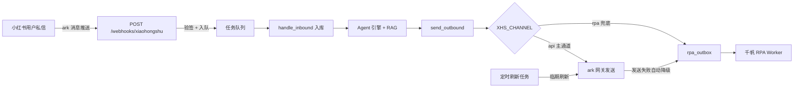
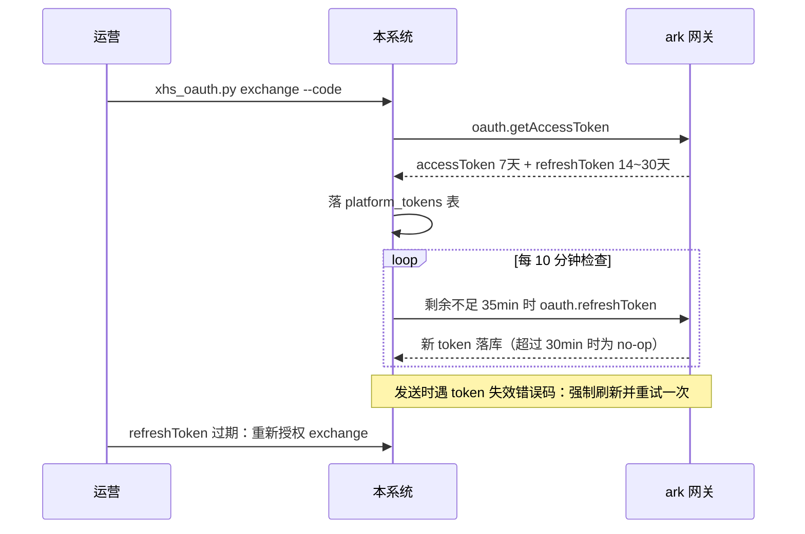

# 小红书接入手册

小红书私信客服接入的完整操作手册。运营/实施人员按第一~五部分操作即可；开发人员排查问题或校准契约时看附录。

## 概述

系统提供两条小红书通道，按需选择：

| 通道 | 前提 | 特点 | 适用 |
|---|---|---|---|
| 官方 API（推荐） | 蓝 V 专业号 + 商业开放平台应用 + 聚光授权 | 稳定合规、消息实时推送、token 自动续期 | 有专业号资质，长期使用 |
| 千帆 RPA 兜底 | 千帆商家后台账号 | 无需开放平台资质，但违反平台用户协议、有封号风险 | 无资质过渡 / API 通道的降级保险 |

整体消息流：



## 第一部分 资质准备

1. **小红书企业专业号（蓝 V 认证）**：个人号无法接入官方 API。认证需营业执照等资质，审核约 3~7 个工作日
2. **（可选）KOS 员工号**：需在专业号平台完成员工号绑定，绑定后员工号的私信会一并通过回调推送给系统
3. **服务器要求**：一个公网可访问的 HTTPS 域名（接收消息推送回调）

## 第二部分 平台侧操作

> 以下操作在小红书各平台后台完成，按顺序执行。

### 步骤 1：创建开放平台应用

- 操作平台：小红书商业开放平台
- 操作：创建应用，记录 `appId` / `appSecret`
- 预期结果：拿到一对应用凭证
- 截图占位：_[应用管理页]_

### 步骤 2：聚光授权三方客服工具

- 操作平台：小红书聚光平台
- 操作：「工具 - 三方客服管理」→ 找到你的应用 →「授权新账号」；授权范围选择「企业号及其绑定的员工号」，勾选**三方工具服务**、**私信留资数据**
- 预期结果：专业号（及其 KOS 员工号）的私信咨询全部接入你的应用
- 注意：一个小红书号仅支持与一个服务商的一个主账号绑定
- 截图占位：_[聚光授权页]_

### 步骤 3：配置消息推送回调地址

- 操作平台：商业开放平台 → 应用管理 → 消息推送
- 操作：开启推送服务，推送地址填写：
  ```
  https://www.cndistribution.com/cs/webhooks/xiaohongshu
  ```
- 预期结果：地址检测状态为「正常」（系统对检测包自动返回成功 ACK）
- 截图占位：_[推送地址配置页]_

### 步骤 4：OAuth 换取 token

- 操作平台：本系统服务器
- 操作：完成授权拿到 `code` 后（10 分钟内有效），在 `backend/` 目录执行：
  ```bash
  python scripts/xhs_oauth.py exchange --code <授权code> --write-env
  ```
- 预期结果：token 落入 `platform_tokens` 表并写回 `.env`，输出类似：
  ```
  换取成功，已落 platform_tokens 表：
  accessToken : xxxx...  过期: 2026-09-28 ...（剩余 6 天 23 小时）
  ```

## 第三部分 系统配置

1. 确认 `backend/.env`：
   ```
   XHS_APP_ID=xxx
   XHS_APP_SECRET=xxx
   XHS_ACCESS_TOKEN=xxx        # 步骤 4 脚本已写入可跳过
   XHS_REFRESH_TOKEN=xxx       # 同上
   XHS_CHANNEL=api             # api（官方 API）| rpa（千帆 RPA 兜底）
   ```
2. 重启后端，访问 `http://localhost:8000/api/health`，确认返回中 `"xiaohongshu": true`

## 第四部分 验证与联调

按顺序执行，任一步失败先查「第七部分 故障排查矩阵」：

1. `python scripts/xhs_oauth.py status` 确认 token 有效且剩余有效期充足
2. 开放平台后台「推送地址检测」通过（系统对 `{"test": true}` 检测包返回成功 ACK）
3. 用真实小红书账号给专业号发一条私信 → 后端日志出现入站记录，无验签失败警告
4. 工作台「对话」页出现该会话（badge 显示小红书），消息内容/昵称解析正确
5. AI 自动回复 → 小红书 App 侧收到消息（若失败，检查日志是否触发 token 刷新或 RPA 降级）
6. 连续对话验证频控（`xiaohongshu` 规则：1 小时 20 条），超限应自动转人工
7. 重启后端后发第二条私信，确认 token 从 `platform_tokens` 表恢复、无需重配
8. 保持千帆 RPA Worker 在线（`python doctor.py --platform xiaohongshu` 全绿），作为 API 通道的降级保险

## 第五部分 日常运维

### Token 管理（全自动，仅需关注告警）

- accessToken 有效期约 7 天，refreshToken 约 14~30 天（以返回的 `expiresAt` 为准）
- 系统每 10 分钟检查一次，剩余有效期 <35 分钟时自动刷新并落库，**无需人工干预**
- 官方规则「剩余 >30 分钟时刷新为 no-op」，周期刷新不会产生多余调用
- 日常查看：`python scripts/xhs_oauth.py status`

### refreshToken 过期处理

refreshToken 过期后无法自动恢复，需重新授权：

1. 重新走一遍聚光授权流程拿到新 `code`
2. 执行 `python scripts/xhs_oauth.py exchange --code <新code> --write-env`

系统对刷新失败有监控告警（`xhs_token_refresh_failure`：1 小时内失败 2 次触发），收到告警后按上述流程处理。

### 监控告警含义

| 告警事件 | 含义 | 处理 |
|---|---|---|
| `xhs_token_refresh_failure` | token 自动刷新失败，refreshToken 可能已过期 | 按上文重新授权 |
| `api_send_fallback` | API 发送失败，已自动降级 RPA 兜底 | 查 API 通道日志（token/频控/网络），修复后恢复 |
| `rpa_outbox_no_account` | 降级消息无 Worker 认领（死信） | 确认千帆 Worker 在线；API 会话降级仅应急，尽快修复 API 通道 |

## 第六部分 FAQ

**Q：个人号能接入吗？**
不能。官方授权仅支持认证的企业专业号（蓝 V）及其绑定的 KOS 员工号。无资质时只能用千帆 RPA 通道（附录 B），有封号风险。

**Q：为什么用户收到双份回复？**
千帆后台的「自动回复」没关。RPA 通道必须关闭千帆自动回复；API 通道若同时开着私信通等官方自动回复工具，也会双份回复。

**Q：收不到用户私信？**
按顺序检查：① 聚光授权是否完成且勾选了「三方工具服务」；② 推送地址检测状态是否正常；③ 后端日志有无验签失败警告（`appSecret` 是否填对）；④ 消息是否被判定为非私信推送而忽略（日志含「忽略非私信推送」）。

**Q：发送失败怎么办？**
先看工作台消息 extra 是否带 `send_fallback: rpa` 标记（已降级兜底，消息没丢）。再查后端日志：token 失效会自动刷新重试；频控超限会自动转人工；其他错误按「故障排查矩阵」处理。

**Q：API 通道和 RPA 通道能同时用吗？**
出站主通道由 `XHS_CHANNEL` 决定（二选一）。但 `XHS_CHANNEL=api` 且配置了 `RPA_API_KEY` 时，API 发送失败会**自动降级** RPA 兜底，建议 RPA Worker 保持在线作保险。

## 第七部分 故障排查矩阵

| 现象 | 可能原因 | 处理 |
|---|---|---|
| 推送地址检测不通过 | 回调地址非公网可达；ACK 格式不对 | 确认地址 https 公网可达；系统已内置 ark ACK 格式，若自定义过反代检查响应体未被改写 |
| 收不到消息，日志有验签警告 | `XHS_APP_SECRET` 错误；验签算法与平台不一致 | 核对 secret；按附录 A 校准 `verify_webhook` |
| 收不到消息，无日志 | 聚光未授权；推送服务未开启 | 重做第二部分步骤 2、3 |
| 发送报 token 失效且重试仍失败 | refreshToken 过期 | 重新授权（第五部分） |
| 发送报频控错误 | 超出平台发送限制 | 等窗口恢复；系统已内置 1h/20 条保护，核对平台实际规则 |
| 消息内容解析错乱 | 平台回调字段与适配器假设不一致 | 按附录 A 校准 `normalize`，用 `raw_payload` 比对 |
| 双份回复 | 千帆/私信通自动回复未关 | 关闭平台侧自动回复 |

## 附录 A 技术契约（开发向）

实现文件：[backend/app/adapters/xiaohongshu.py](../backend/app/adapters/xiaohongshu.py)

### ark 网关调用

- 网关地址：`https://ark.xiaohongshu.com/ark/open_api/v3/common_controller`
- 系统参数：`appId`、`version=2.0`、`timestamp`（毫秒）、`method`、`sign`
- 签名：除 `sign` 外参数按 key 字母序拼接 `k1v1k2v2...`，首尾拼 `appSecret` 后取 MD5（`_sign` 方法）

### 消息推送（入站）

- 推送体为数组信封：`[{"msgTag": "...", "sellerId": "...", "data": "<JSON 字符串>"}]`，webhook 层逐条拆包入队
- ACK 必须返回 `{"success": true, "error_code": 0, "error_msg": ""}`，否则平台判定失败并重推（适配器 `ack_response()` 已实现）
- 验签：URL query 参数（除 `sign`）按字母排序用 `&` 连接，首尾拼 `appSecret` 取 MD5，与 query 中的 `sign` 比对；body 不参与签名
- `{"test": true}` 为地址检测包，自动忽略；非私信类 msgTag（订单/售后等）不入客服消息流

### Token 生命周期



### 契约校准对照表（联调期重点）

适配器按 ark 网关公开规则实现，拿到权限后请用真实回调核对，改动收敛在适配器单文件：

| 位置 | 待校准项 | 校准方式 |
|---|---|---|
| `METHOD_SEND_MESSAGE` | 发送 method 名（占位 `im.sendMessage`） | 对照开放平台后台 IM 接口文档 |
| `_sign` | 网关签名算法（参数排序 + 首尾拼 secret 取 MD5） | 对照「sign 签名算法」文档 |
| `verify_webhook` | 推送验签（URL query 参数排序 & 连接 + MD5，body 不参与） | 用真实推送的 sign 验证 |
| `normalize` | msgTag 取值、data 内字段名（已做多候选键兼容） | 打印真实回调 `raw_payload` 比对 |
| `_TOKEN_INVALID_CODES` | token 失效错误码集合 | 用真实失效返回补充 |

## 附录 B RPA 兜底通道（无 API 资质时）

无专业号/服务商资质时，用 RPA Worker 自动化「千帆 Web 后台」私信页（文本/图片双向）：

```
# backend/.env
RPA_API_KEY=<与 Worker 一致的随机密钥>
XHS_CHANNEL=rpa
```

1. 在商家电脑运行 `workers/` 下的千帆 Worker：`python xhs_ark_worker.py`
2. **前置条件：关闭千帆「自动回复」**，否则双份回复
3. 启动前务必跑 `python doctor.py --platform xiaohongshu` 八项自检（后端连通 / RPA key / 浏览器 / 平台可达 / 登录态 / 选择器 / 媒体回路 / 机器人关闭），全绿才可用
4. 选择器漂移时按 doctor 报告提示更新 `xhs_ark_worker.py` 的 `SELECTORS`
5. 若千帆 Web 私信能力受限，降级路径为 Android 无障碍 Worker（见 [rpa-workers.md](rpa-workers.md) Phase 3）

> 合规提示：RPA 违反平台用户协议，有封号风险，仅限自有账号低频使用；获得官方权限后应切回 `XHS_CHANNEL=api`。
